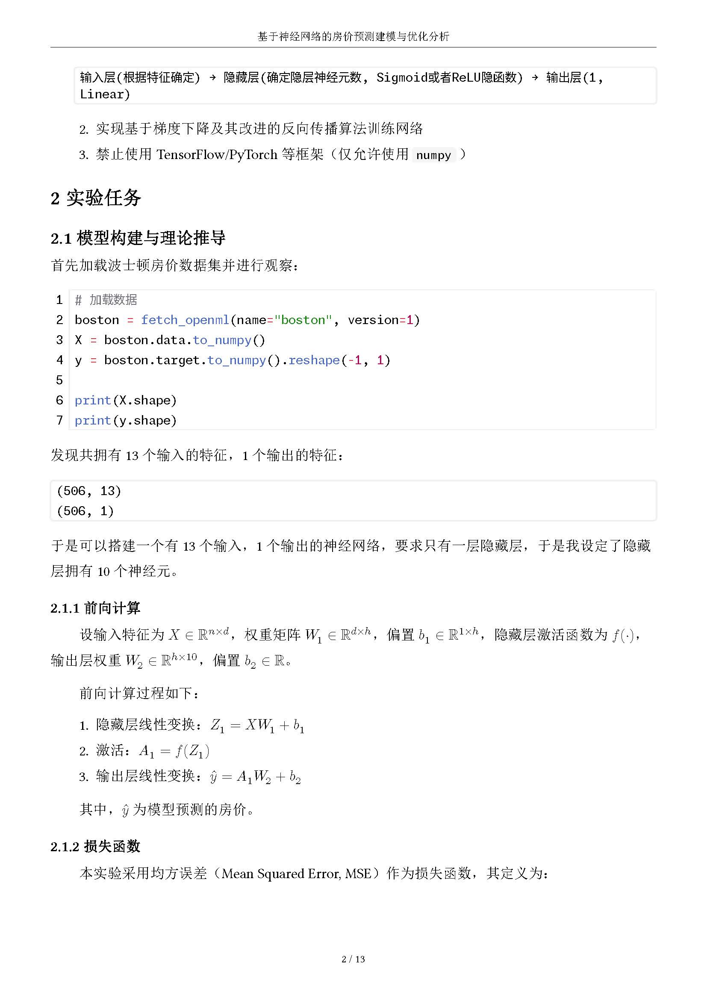

# 实验报告模板

开箱即用的 Typst 实验报告模板，附带完整用例（基于神经网络的房价预测建模与优化分析），包含[编译后的 PDF 文档](example.pdf)、[Typst 源文件](example.typ)。

<table>
  <tr>
    <td></td>
    <td></td>
  </tr>
</table>

## 特性

- 开箱即用，配置简单，所有样式代码均存放在 [style.typ](style.typ)
- 包含一个简单的目录
- 奇偶页不同页眉，以及简单页码
- 使用 `p` 段落函数，自由控制段落是否首行缩进，同时会缩进列表等部分元素
- 使用 [Cuti](https://typst.app/universe/package/cuti) 提供无字重字体的伪粗体（如宋体）
- 使用 [Codly](https://typst.app/universe/package/codly) 提供高级代码块支持
- 使用 [i-figured](https://typst.app/universe/package/i-figured) 提供符合中文习惯的图片、表格、公式编号，并可以正常引用

## License

MIT License
