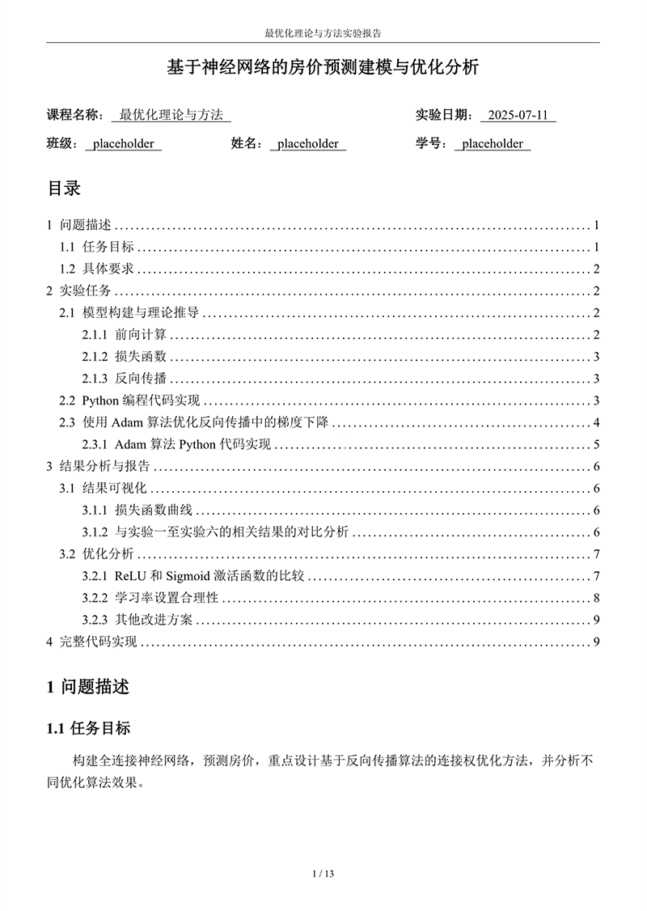

# 实验报告模板

开箱即用的 Typst 实验报告模板，附带[示例](example.typ)，以及[编译后的 PDF 文档](example.pdf)。

<table>
  <tr>
    <td></td>
    <td></td>
  </tr>
</table>

## 特性

- 开箱即用，配置简单，所有样式代码均存放在 [style.typ](style.typ)
- 包含一个简单的目录
- 默认使用三线表表格
- 奇偶页不同页眉，以及简单页码
- 默认开启缩进，可以使用 `no-indent` 函数临时关闭缩进
- 使用 [Cuti](https://typst.app/universe/package/cuti) 提供无字重字体的伪粗体（如宋体）
- 使用 [Codly](https://typst.app/universe/package/codly) 提供高级代码块支持，默认支持行号显示
- 使用 [i-figured](https://typst.app/universe/package/i-figured) 提供符合中文习惯的图片、表格、公式编号，并可以正常引用

## License

MIT License
